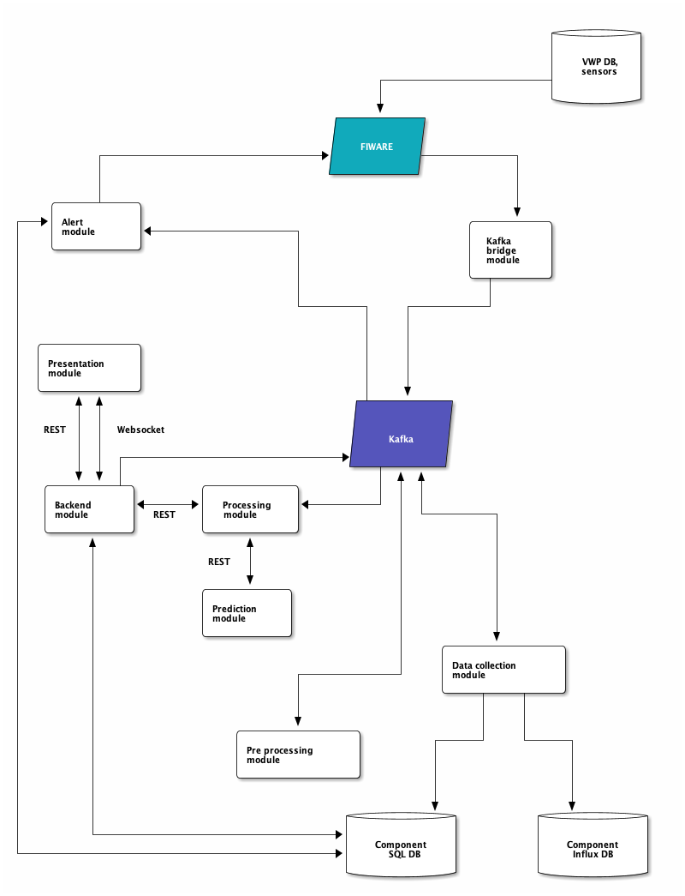

# Development

## Project structure

Starting from the top-right corner of the figure below we have an item called **VWP DB, sensors** representing the data sources that are needed to run
PMADAI component. VWP DB contains information about painting process performed in VW paint shop, as well
as time-series data regarding that process (voltage, current, etc.), which comes from sensors placed in the VW factory.

Data processed by PMADAI module are stored in two types of databases: **Component SQL DB** and **Component Influx DB**.

Other elements needed for correct functioning of PMADAI component include:

### FIWARE

This is a gateway to our software. Contextual information from external sources, such as VW paint shop is
pushed to FIWARE (Orion context broker, to be precise). Further on, through notifications, it flows to our component.
We distinguish two types of data processed by PMADAI component.
The first one is so-called works statuses, which are meta-date describing the painting process.
The second type of data are time-series data regarding data called measurements.
Please take a look at [data models](./data-models.md) for more details regarding considered types of data.

### Kafka

Most of the communication between different components in our software takes place with the use of Apache Kafka.
We particularly like scalability and fault-tolerance of kafka in that matter, as well as a asynchronous nature of it.

The data from VWP is published in a multiple topics, which can be read further down the road be the rest of component modules.

### Component modules

PMADAI component is structured into the following modules.

#### Kafka bridge module

This is a listener-type of module, which waits for Orion notifications with data updates. Once notified,
it pushes the updates further to Kafka.

#### Data collection module

ML models used by PMADAI need to be trained at some point, and you need data to do that. Our data collection component
persists VW process-related data into databases: **Component SQL DB** and **Component Influx DB**. The main purpose of
storing this data is to use it afterwards for model re-training.

#### Pre processing module

In parallel to our data collection module which collects data on the fly, the data is also preprocessed for prediction purposes.
This is the main responsibility of the preprocessing module - to prepare small batches of data, that we further use to perform
detection / prediction with use of ML models.

#### Processing module

This module works as a kind of communication hub between our backend API and the prediction API.

It listens for a batches of data in a specific kafka topic and then runs prediction on that batches of data.

Once prediction is run, the results of it are stored in **Component SQL DB** through our backend API.

#### Prediction module

You can think of it like of a brain of our application. This is the place where the ML models are stored.

The prediction module receives a batch of data from processing module, runs predictions against it and then returns them to the processing module.

#### Backend module

This module serves as a backend for the presentation module. It exposes API with information about data collected from
VWP factory as well as predictions regarding this data, obtained from the prediction module (through processing).

#### Presentation module

This module communicates with the backend module to provide the users with the latest analyses.  

The communication is maintained via REST (to query specific resource data) as well as Websockets,
for asynchronous updates (presenting new data to the users as soon as it arrives into our system from VWP).

#### Alert module

There is also an alert module which monitors messages in a specific kafka topic and sends alerts if a specified
set of situations occurs in the VWP system. It then publishes this alerts into FIWARE gateway, which can be further processed by other
FIWARE compatible components. Please take a look at [alert data model](./alert-data-model.md) for more information regarding alerts.
